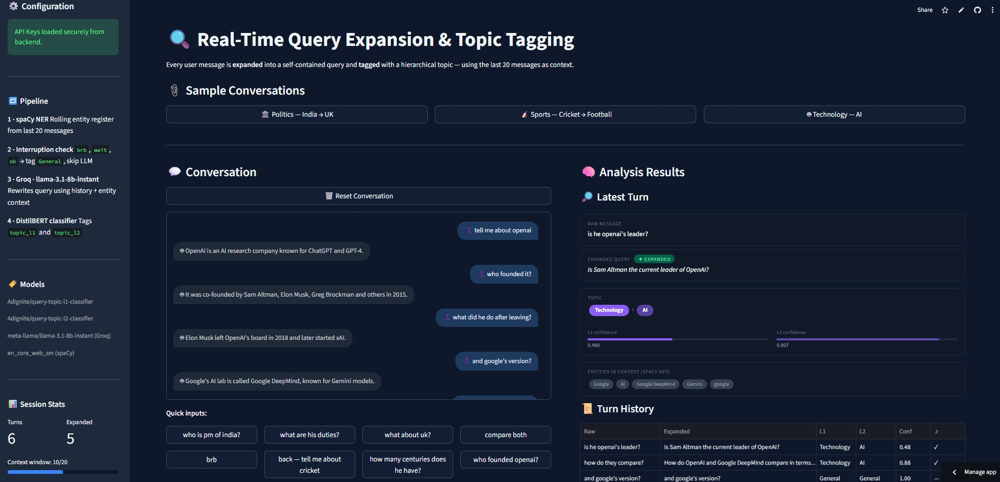

# 🔍 Real-Time Query Expansion & Topic Tagging

End-to-end Streamlit app that watches a live conversation and for every user message:
- **Expands** implicit queries (pronouns, ellipsis, topic switches) into self-contained questions
- **Tags** each message with a 2-level topic label (e.g. `Politics > India`)

## Models Used
| Component | Model |
|-----------|-------|
| Topic L1 Classifier | `Adignite/query-topic-l1-classifier` |
| Topic L2 Classifier | `Adignite/query-topic-l2-classifier` |
| Query Expansion LLM | `meta-llama/Llama-3.2-1B-Instruct` |
| Named Entity Recognition | `en_core_web_trf` (spaCy) |

---

**Live Demo:** [Check out the App on Streamlit](https://gsdtepaqrm57qwsoqzz4qu.streamlit.app/)

**Backend** [Checkout the Project Repo](https://github.com/DeityAG/Real-Time-Query_Expansion_amd_Topic-Tagging_backend_pipeline)

This repository contains an end-to-end conversational AI utility that monitors a live dialogue and processes every user message in real-time. It transforms implicit, context-dependent shorthand into fully self-contained questions and applies a hierarchical, two-level topic classification.

## 🚀 The Problem
In human conversation, we often use pronouns ("What are **his** duties?"), ellipsis ("And in the **UK**?"), or temporary interruptions ("Wait, **brb**"). Standard NLP systems often fail to categorize these messages correctly because they lack historical context. This system solves that by maintaining a sliding context window and an entity register.

## ✨ Key Features
* **Query Expansion:** Resolves pronouns and topic shifts using **Llama-3.1-8b-instant** (via Groq API).
* **Hierarchical Tagging:** Categorizes queries into a 2-level hierarchy (e.g., `Politics > India` or `Sports > Cricket`).
* **Entity Register:** Uses **spaCy NER** to track people, organizations, and locations across the last 20 messages.
* **Interruption Handling:** Detects small talk and conversational pauses (e.g., "ok," "one sec") to bypass unnecessary LLM calls and tag them as `General`.
* **High Performance:** Built with **DistilBERT**, achieving **95.85% accuracy** on L1 topic classification.

## 🛠️ Tech Stack
| Component | Technology |
| :--- | :--- |
| **Frontend** | [Streamlit](https://streamlit.io/) |
| **LLM Inference** | [Groq](https://groq.com/) (**Llama-3.1-8b-instant**) |
| **Topic Classifier** | Fine-tuned **DistilBERT** (hosted on Hugging Face) |
| **NER Engine** | **spaCy** (`en_core_web_sm`) |
| **Environment** | Python 3.10 |

## 🏗️ Pipeline Architecture
1.  **Context Management:** Maintains a sliding window of the last 20 dialogue exchanges.
2.  **Entity Tracking:** Extracts and stores named entities (PERSON, GPE, ORG) from every turn.
3.  **Interruption Detection:** Filters out short non-query messages.
4.  **LLM Expansion:** Rewrites the raw message into a standalone query using the context window and entity register.
5.  **Classification:** Runs the expanded query through L1 and L2 DistilBERT classifiers.

## 📦 Installation & Setup

### 1. Clone the repository
```bash
git clone https://github.com/DeityAG/Real-Time-Query_Expansion_amd_Topic-Tagging.git
cd Real-Time-Query_Expansion_amd_Topic-Tagging
```

### 2. Install dependencies
```bash
pip install -r requirements.txt
```

### 3. Configure Secrets
Create a `.streamlit/secrets.toml` file or add these to your environment variables:
```toml
GROQ_API_KEY = "your_gsk_key_here"
HF_TOKEN = "your_hf_token_here"
```

### 4. Run the app
```bash
streamlit run app.py
```

## 📊 Model Performance
The topic classifiers were fine-tuned on a custom dataset using `distilbert-base-uncased`. DistilBERT was chosen for its balance of speed (60% faster than BERT-base) and performance.

* **L1 Accuracy:** 95.85%
* **F1 Macro Score:** 94.07%
* **Deployment:** Models are served directly via Hugging Face Transformers Pipelines.

## 📁 File Structure
```
app.py               Main Streamlit application
requirements.txt     Python dependencies
.streamlit/
  config.toml        Dark theme + server config
  secrets.toml       HF token (local only, not committed)
.gitignore           Excludes secrets.toml
README.md            This file
```
---
*Developed for research in real-time conversational context resolution.*

